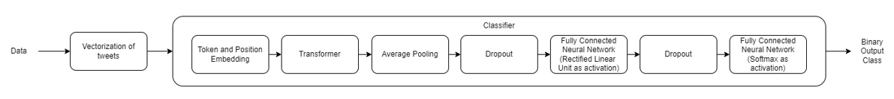

# Predicting-Stock-Movement-using-Transformers
In this repository, the stock movement prediction is performed from the tweets data of various stocks using transformer along with some layers of neural networks as the classification model.
Please see following image for the detailed architecture of the system.

This repository is a contribution to a team project towards ELEC 825 Machine Learning and Deep Learning course.
The code for the whole project can be found [here](https://github.com/Sudhandar/ELEC825-Project).